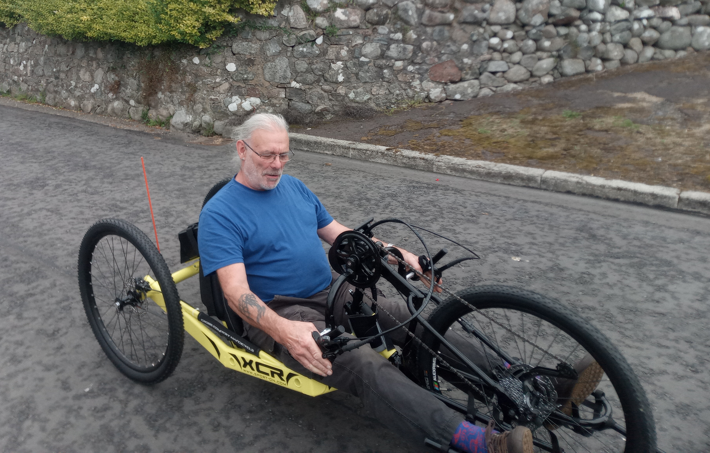

{:author "Simon Brooke",
 :date "2025-07-25",
 :description "Auchencairn Climate Transition now has a hand cycle, designed to allow people with leg impairments to ride, as a new addition to our cycle hire fleet. These notes are to help you use it.",
 :image "../../img/2025-07-22-14-06-16-105.jpg",
 :inferred-meta true,
 :tags ["Transport" "Cycle project"],
 :title "Hand cycle notes"}

Auchencairn Climate Transition now has a hand cycle, designed to allow people with leg impairments to ride, as a new addition to our cycle hire fleet. These notes are to help you use it.

## Important for everyone\!

Be careful of the cables and hoses from the hand-grips wrapping round the handlebars – if this happens it will rip the brake hoses out of the levers, making the cycle unsafe to ride until quite technical repairs have been done. This is a significant vulnerability. The cables and hoses should arch up in one smooth arch from the hand lever to the steering head, where the motor control unit is mounted.

If you’re introducing a new user to the cycle, please emphasise this to them\!

## Notes for users

Take your phone and anything else precious out of shorts/trouser pockets before riding, because cranks will hit your hips when turning, and things in your hip pockets can get broken.

Because of this, you can't pedal the full rotation when turning, so when turning ratchet the cranks back and forward over the top arc of their rotation.

Don't ride alone. A rider with mobility impairments can't easily fix a puncture, and the restricted turning circle means assistance may be needed for multi-point turns. 

Wear eye protection – the front wheel tends to throw mud into the rider’s face.

Set off with the cranks slightly forward of top dead centre.

Change gear only when pedalling.

There are nine power settings, which can be selected by pressing the ‘plus’ and ‘minus’ buttons on the control head. We advise you to use lower power settings, and use the gears to get up hills. Using higher power settings will exhaust the battery more quickly, and this cycle is very hard to pedal once the battery is exhausted.

The battery tends to overheat on long climbs, stopping at the top to give it a rest to cool down will give better battery life.

DON’T OPERATE HEAD UNIT BUTTONS WHILE PEDALLING\! Otherwise the cranks will catch your hand, and there’s a risk of injury.

Think about urine bags, colostomy bags – if you wear them, make sure these are somewhere where they won't be damaged by any part of the cycle, especially during mounting/dismounting.

The seat cushion on the cycle does not suit all riders. You may prefer to use the cushion off your own chair.

When getting onto the cycle, first get your ‘far side’ leg through over the seat before attempting to get into the seat.

### Things to carry with you on rides

On a ride, carry zip ties, tape, and eye-wash vials. 

## Notes on setting up the cycle

Make sure the rider can comfortably operate the brakes\! The rake of the seat back is adjustable with a screw below the battery. Shorter riders may need a more upright position and taller riders a more laid back position. It is not possible to adjust the distance between the seat and the steering head. Be sure to retighten the adjustment screw\!

Adjust the leg baskets so that the rider’s feet are fully supported but do not press against the front of the basket. It may be necessary to undo and rebuckle some of the straps of the basket to do this.

If the rider has back stability issues, there’s a broad chest belt in the bag of extra bits. This goes round the rider’s chest (obviously) and under the strut supporting the seat back. It fastens with velcro. Also in the bag are a number of small cushions which may be used for padding anywhere the rider is rubbing uncomfortably against part of the machine.

If the rider suffers from leg spasms, their legs should be strapped into the leg baskets with velcro straps which will also be found in the bag.

When riding on the road, the flag is advised. It should be found in the bag.

To turn on the motor assist system, press the power button on the battery, then press and hold the power button on the head unit for four seconds. Note that, obviously, the rider cannot reach the power button on the battery when seated in the seat, so either they must do this before they sit in the cycle or someone else must do it for them.

## Notes on Maintenance

To remove the front wheel, first remove the foot baskets, then completely remove the skewer.

To remove the back wheels, support the rear of the cycle, completely remove the central bolt (19mm spanner), carefully remove the disk from the caliper. Ideally then put caliper wedges in to prevent anyone pulling the brake levers\!

Bikes currently have factory grease on the chain. We advise use of a dry wax lube.

The ratchet is at the crank end of the transmission, not at the wheel\!

When bleeding the brakes, bleed both rears together, and then leave the cycle standing vertically on rear for 36 hours to allow air to bubble up to hand lever then do final bleed.

Geometry of the steering does not automatically self centre. The rubber cylinder on the steering column is critical – does both self centring and steering damping. If the rubber is cracking, replace it\!

Advise fitting a smaller chainring.

## Failure modes 

E-assist motor cuts out: usually misalignment of the wheel rotation sensor or magnet. Screen says error. Advise carrying spare magnet.

Plug/socket on steering head separates. Reconnect.

Plug/socket on rear axle tube separates. Reconnect.

Battery falls off: Replace and strap on securely.

**Tags:** Cycle project, Transport
